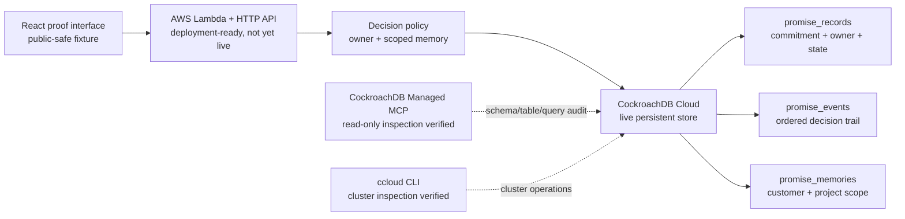

# Promise Ledger Architecture

Promise Ledger treats a promise as an accountable record, not a chat summary. The interface is a public-safe proof surface; the persistence layer is designed to preserve the decision trail behind it.

## Decision boundary

| Inputs | Decision | What happens |
| --- | --- | --- |
| No accountable owner | `ASSIGN_OWNER` | The record cannot advance. |
| Owner, but no matching customer-plus-project memory | `HOLD_FOR_CONTEXT` | The agent waits rather than inventing a customer follow-up. |
| Owner and matching scope | `PREPARE_REVIEW_DRAFT` | A review-only draft may be prepared. It is never sent automatically. |

The CockroachDB Cloud cluster, schema replay, and read-only MCP inspection are verified with public-safe fixture data. The AWS application-service path stays explicitly deployment-ready, not live, until a Lambda endpoint and evidence replay are verified together.
